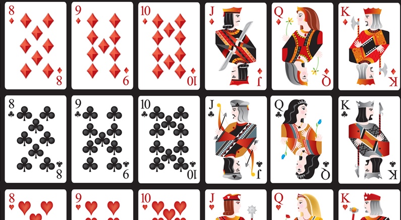

#BlackJack game using jQuery & Javascript (styled with Bootstrap)

#####The game has three primary buttons:  deal hit and stand.  Notice how the buttons become disabled once the game reaches a point in which their functionality is no longer needed/allowed.  But the real reason I have highlighted this project is because of the algorithm I created to display the correct card on the sprite sheet!  I have included a snippet of the sprite sheet to give you perspective but you can always check it out [inside this repo.](../blob/master/images/card-deck.jpeg)



#####While not particularly demanding, in order to make the cards appear properly, I had to calculate the starting (x,y)=>(-45,-27)coordinates of the first card on the sheet, discover the proper height and width of every card (76, 107), and finally, account for the spaces between the cards both horizontally(5) and vertically(6).  These numbers are approximate because either the sprite sheet isn't perfect or my resizing of the sheet created a slight inconsistency in pixels.

#####I was lucky with this sheet as every suit is organized into a row with a specific x-axis, and every card value is organized into a column with a specific y-axis.  Essentially, the function calculates where that value is located on the sprite sheet `axisX = -46 - (76 * (cardValue - 2))` and then aligns it with the row that contains the appropriate suit `if(suitValue == 'suit'){axisY = suit_row_y_axis;}`.  


```javascript
function placeCard(who, where, card){
    var classSelector = '.'+who+'-cards .card-'+where;
    var axisX = 0;
    var axisY = 0;
    var suitValue;
    var cardValue = card.slice(0, -1);
    if(card.length == 3){
        suitValue = card.slice(2);
    }else{
        suitValue = card.slice(1);
    }
        if(cardValue == 2){
            axisX = -45;
        }else if(cardValue > 10){
            axisX = -46 - (76 * (cardValue - 2));
        }else if(cardValue > 2){
            axisX = -45 - (76 * (cardValue - 2));
        }else{
            axisX = -958;
        }
            if(suitValue == 'd'){
                axisY = -27;
            }else if(suitValue == 'c'){
                axisY = -133;
            }else if(suitValue == 'h'){
                axisY = -240;
            }else{
                axisY = -347;
            }
    $(classSelector).css("background-image", "url('images/card-deck.jpeg')");
    $(classSelector).css("background-size", "1151px");
    $(classSelector).css("background-position", axisX + "px " + axisY + "px");
}
```

### Live Demo @ http://www.dannyarango.com/blackjack
